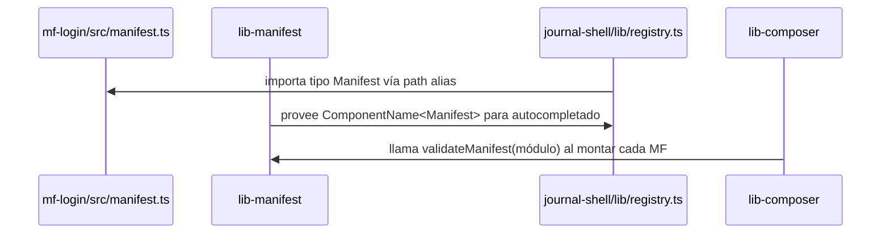

# lib-manifest

**Librería TypeScript — Contrato estático de microfrontends.**

Repositorio: [github.com/JairPrada/lib-manifest](https://github.com/JairPrada/lib-manifest)

Define los tipos, schemas Zod y utilidades que describen la estructura de un microfrontend: qué componentes expone, qué props acepta y qué eventos declara. También incluye un plugin de Vite que genera `manifest.json` en build time.

---

## Responsabilidad única

Esta librería **solo** define el contrato estático de un MF. No contiene lógica de eventos ni de montaje.

---

## API

### `defineManifest(manifest)`

Función identidad que provee inferencia de tipos al manifest. Úsala en `src/manifest.ts` de cada MF para que los nombres de componentes sean tipos literales.

```ts
// mf-login/src/manifest.ts
export const manifest = defineManifest({
  name: "mf-login",
  framework: "react",
  port: 3001,
  components: [
    { name: "Login", props: [] },
    { name: "LoginWithCredentials", props: [] },
  ],
  events: [ ... ],
});
export type Manifest = typeof manifest;
```

### `validateManifest(mod)`

Lanzada por `lib-composer` al montar un MF. Lanza un error si el módulo no cumple el contrato `MFModule` (debe tener `mount`, `unmount` opcional y `manifest`).

### `ComponentName<Manifest>`

Tipo utilitario que extrae la unión de nombres de componentes desde un manifest:

```ts
// Dado: { components: [{ name: "Login" }, { name: "LoginWithCredentials" }] }
// ComponentName<Manifest> === "Login" | "LoginWithCredentials"
```

El shell usa este tipo para dar autocompletado al elegir qué componente montar.

### Plugin Vite: `manifestPlugin()`

Se usa en `vite.config.ts` de cada MF. Al terminar el build, analiza `src/manifest.ts` con `ts-morph` (sin ejecutarlo) y escribe `dist/manifest.json`.

```ts
// vite.config.ts de cada MF
import { manifestPlugin } from '@journals/lib-manifest/vite-plugin'
export default defineConfig({ plugins: [manifestPlugin()] })
```

---

## Tipos principales

| Tipo | Descripción |
|---|---|
| `MFManifest` | Estructura completa de un manifest (name, version, framework, components, events) |
| `MFComponentDeclaration` | `{ name, description?, props[] }` |
| `MFPropDeclaration` | `{ name, type, required, description? }` |
| `MFEventDeclaration` | `{ event, direction: "emits"\|"listens", payload }` |
| `MFModule` | `{ manifest, mount(el, component, props), unmount?(el) }` |
| `ComponentName<M>` | Unión de nombres de componentes de un manifest |

---

## Cómo se conecta con el shell



---

## Build

```bash
pnpm --filter @journals/lib-manifest build
# salida: dist/index.js, dist/index.d.ts, dist/vite-plugin-manifest.js
```
